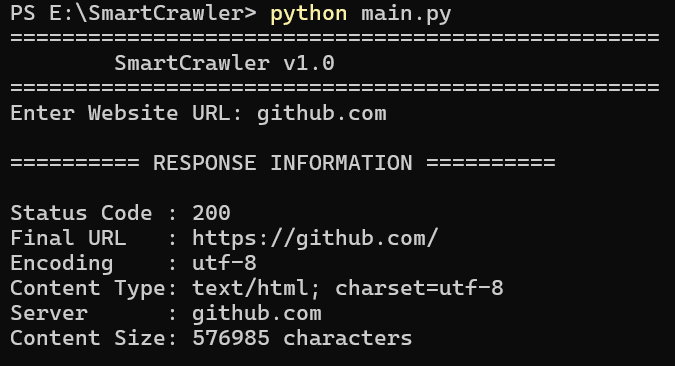
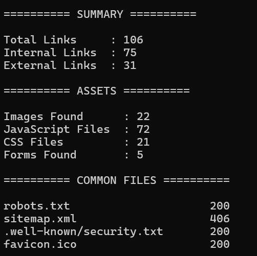
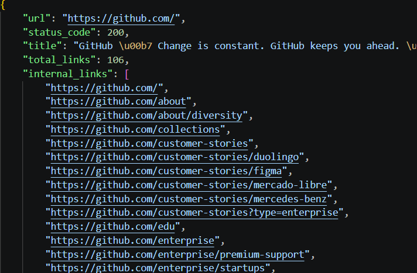

# 🕷️ SmartCrawler - Web Reconnaissance Toolkit


## 📌 Overview

SmartCrawler is a Python-based web reconnaissance tool developed for cybersecurity professionals, penetration testers, bug bounty hunters, and students.

The tool automates the initial reconnaissance phase by crawling websites, extracting useful resources, identifying important files, and generating structured JSON reports.

It is designed to work on both **Windows (PowerShell)** and **Kali Linux**.

---

# ✨ Features

- 🌐 Fetch webpage content
- 📄 Extract webpage title
- 🔗 Extract all hyperlinks
- 🏠 Classify Internal & External Links
- 🖼 Extract Images
- 📜 Extract JavaScript Files
- 🎨 Extract CSS Files
- 📝 Detect HTML Forms
- 🤖 Check robots.txt
- 🗺 Check sitemap.xml
- 🔒 Check security.txt
- ⭐ Check favicon.ico
- 📊 Generate JSON Reports
- 💻 Cross Platform (Windows & Linux)

---

# 📂 Project Structure

```
SmartCrawler
│
├── crawler/
│   ├── __init__.py
│   ├── crawler.py
│   ├── discovery.py
│   ├── extractor.py
│   ├── parser.py
│   ├── reporter.py
│   └── utils.py
│
├── docs/
│   ├── Architecture.md
│   ├── Installation.md
│   └── UserGuide.md
│
├── reports/
│
├── screenshots/
│
├── tests/
│
├── .gitignore
├── LICENSE
├── README.md
├── requirements.txt
└── main.py
```

---

# ⚙️ Installation

## Clone Repository

```bash
git clone https://github.com/tejaswiniPatange-613/SmartCrawler.git
```

Move into project directory

```bash
cd SmartCrawler
```

Install dependencies

```bash
pip install -r requirements.txt
```

---

# ▶ Usage

Run

```bash
python main.py
```

Enter website

```
github.com
```

---

# 📸 Screenshots

## Home Screen



---

## Scan Summary



---

## JSON Report



---

# 📊 Example Output

```
========== SUMMARY ==========

Total Links     : 106
Internal Links  : 75
External Links  : 31

========== ASSETS ==========

Images Found      : 22
JavaScript Files  : 72
CSS Files         : 21
Forms Found       : 5

========== COMMON FILES ==========

robots.txt                     200
sitemap.xml                    406
security.txt                   200
favicon.ico                    200
```

---

# 📄 JSON Report

After every scan, SmartCrawler automatically generates

```
reports/report.json
```

The report contains

- URL
- Status Code
- Page Title
- Internal Links
- External Links
- Images
- JavaScript Files
- CSS Files
- Forms
- Common Files

---

# 🛠 Technologies Used

- Python 3
- Requests
- BeautifulSoup4
- JSON
- urllib

---

# 🎯 Use Cases

- Web Reconnaissance
- Bug Bounty Hunting
- Penetration Testing
- Security Research
- Website Enumeration
- Cybersecurity Learning

---

# 🚀 Future Improvements

- Recursive Crawling
- Multithreading
- HTML Reports
- CSV Reports
- Technology Fingerprinting
- Security Header Analysis
- JavaScript Endpoint Extraction
- CLI Arguments

---

# 👩‍💻 Author

**Tejaswini Patange**

---

# 📜 License

This project is licensed under the MIT License.